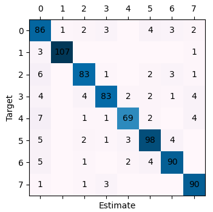
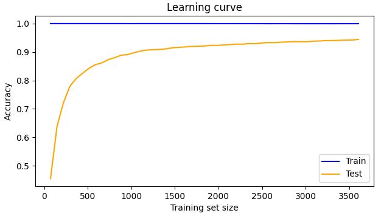

# Dataset overview

KDC-4007 dataset collection, the Kurdish Documents Classification text for the Sorani dialect.
It is a set of corpus contains about 4,007 articles talking about the following topics:

| №   | Category  | Count |
|-----|-----------|-------|
| 0   | religion  | 500   |
| 1   | sport     | 500   |
| 2   | health    | 501   |
| 3   | education | 500   |
| 4   | art       | 501   |
| 5   | social    | 502   |
| 6   | style     | 502   |
| 7   | economy   | 501   |

There are four datasets in the collection:

- ST-Ds. Just stop words elimination is performed by using Kurdish preprocessing-step approach (20150 columns).
- Pre-Ds. Kurdish preprocessing-step approach is used (13128 columns).
- Pre+TW-Ds. TFxIDF term weighting on Pre-Ds dataset is performed (13202 columns).
- Orig-Ds. No process is used which is original dataset (24816 columns).

_For more info see: dataset/readme.txt_

# Goal

Train an ML algorithm to classify Kurdish Documents. The only criteria for model comparison is accuracy, result
interpretation is irrelevant.

Compare the following algorithms:

- Logistic regression (LR)
- Support Vector Machine (SVM)
- Classification and Regression Trees (CART)
- Random forest (RF)

Use cross-validation to pick parameters.

# Development

We will use the dataset containing **TF-IDF** scores for each word. It has 13202 columns. First column is the target,
other are features. We will **not perform feature selection and engineering** because it's out of the scope of this
project.

Target is categorical and balanced, so we'll use **accuracy** metric for model selection.

## Logistic regression

We'll use _LogisticRegressionCV_ with _liblinear_ solver. It doesn't support warm-starting, but it is recommended for
highly dimensional data.

Confusion matrix:


```text
train_LR
```

Accuracy: 94%

Accuracy (train): 100%

## Support vector machine

We will use _LinearSVC_ because the correlation between text class and words must not be very complex, and it uses _OvR_
scheme which is more efficient than _OvO_. Also, our data is balances, so _OvR_ is totally applicable.


```text
train_SVM
```

| Param | Best value |
|-------|------------|
| C     | 0.06       |

Accuracy: 95%

Accuracy (train): 100%

## Classification and Regression Trees


```text
train_CART
```

| Param                 | Best value |
|-----------------------|------------|
| criterion             | gini       |
| max_depth             | 400        |
| min_impurity_decrease | 0          |
| min_samples_leaf      | 1          |
| min_samples_split     | 2          |

Accuracy: 83%

Accuracy (train): 100%

## Random forest

**Iteration 1**:

| Param             | Best value |
|-------------------|------------|
| criterion         | gini       |
| max_depth         | 300        |
| max_samples       | None       |
| min_samples_leaf  | 2          |
| min_samples_split | 2          |
| n_estimators      | 100        |

We've established some optimal params: such as _criterion_, _max_samples_, _min_samples_split_, but it would be nice to
fine-tune other params because their best values happened to be on the edge of range. Ideally, we should repeat
cross-validation for all the values we previously tested, because new hyper-param values may influence optimal values of
others, but we better ignore this micro optimization in favor of speed.

**Iteration 2**:

| Param             | Best value |
|-------------------|------------|
| max_depth         | 140        |
| min_samples_leaf  | 2          |
| n_estimators      | 125        |



```text
train_RF
```

Accuracy: 88%

Accuracy (train): 93%

# Results analysis

| Place | Model | Accuracy | Accuracy (train) |
|-------|-------|----------|------------------|
| 1     | SVM   | 95%      | 100%             |
| 2     | LR    | 94%      | 100%             |
| 3     | RF    | 88%      | 93%              |
| 4     | CART  | 83%      | 100%             |

_DTs_ performed not so good because they accumulate error when split continuous data into discrete pieces. They're
better candidates for data with categorical values.

_SVM_ and _LR_ have similar results because they both fit a linear hyperplane. However, _SVM_, besides optimizing
accuracy, optimizes decision boundary margin, which makes it less susceptible to over-fitting. That's why they have the
same train accuracy, but test accuracy is slightly better for _SVM_.

Regardless, _SVM_ and _LR_ have a decent accuracy, they have an obvious **over-fit**. The parameters for these models
have been fine-tuned using cross-validation, so this performance is their max with the current dataset. The reason of
high variance in this case is that there are very few unique values for each dimension in the dataset, so hyperplane is
very sensitive to new data. This, in turn, is caused by sparsity and extreme dimensionality of the data.

One way to solve this issue is to **enlarge the data set several times**. From the plot below we can assume that 5-time
increase of the dataset would halve the error:



```text
plot_learning_curve
```

The other way to improve accuracy is to perform **dimensionality reduction**. One might want to filter irrelevant
features, compress them or engineer new ones. Unfortunately, this is out of the scope of this project. The goal was to
build LR, SVM, CART and RF models, using CV. This is done and, in fact, we've got the same results as the authors of
this dataset [^1].

[^1]: _Tarik A. Rashid, Arazo M. Mustafa and Ari M. Saeed, 2017."A Robust Categorization System for Kurdish Sorani Text
Documents". Information Technology Journal, 16: 27-34._
