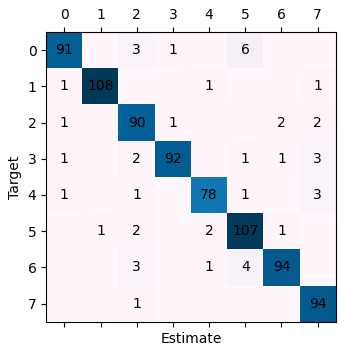
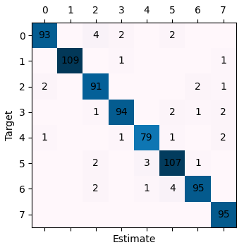
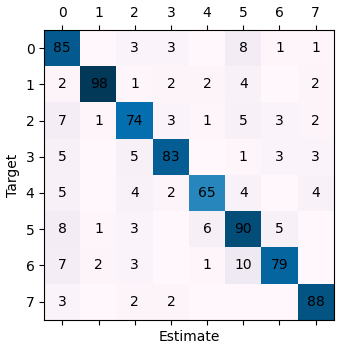

# Dataset overview

KDC-4007 dataset collection, the Kurdish Documents Classification text for the Sorani dialect.
It is a set of corpus contains about 4,007 articles talking about the following topics:

| №   | Category  | Count |
|-----|-----------|-------|
| 1   | religion  | 500   |
| 2   | sport     | 500   |
| 3   | health    | 501   |
| 4   | education | 500   |
| 5   | art       | 501   |
| 6   | social    | 502   |
| 7   | style     | 502   |
| 8   | economy   | 501   |

There are four datasets in the collection:

- ST-Ds. Just stop words elimination is performed by using Kurdish preprocessing-step approach (20150 columns).
- Pre-Ds. Kurdish preprocessing-step approach is used (13128 columns).
- Pre+TW-Ds. TFxIDF term weighting on Pre-Ds dataset is performed (13202 columns).
- Orig-Ds. No process is used which is original dataset (24816 columns).

_For more info see: dataset/readme.txt_

# Goal

Train an ML algorithm to classify Kurdish Documents. The goal is to make it as accurate as possible, result
interpretation is irrelevant.

Compare the following algorithms:

- Logistic regression (LR)
- Support Vector Machine (SVM)
- Classification and Regression Trees (CART)
- Random forest (RF)

Use cross-validation to compare models and parameters.

# Development

We will use the dataset containing **TF-IDF** scores for each word. It has 13202 columns. First column is the target,
other are features. We will **not perform feature selection and engineering** because it's out of the scope of this
project.

Target is categorical and balanced, so we'll use **accuracy** metric for model selection.

## Logistic regression

We'll use _LogisticRegressionCV_ with _liblinear_ solver. It doesn't support warm-starting, but it is recommended for
highly dimensional data.

Confusion matrix:



```text
train_LR
```

Accuracy: 94%

Accuracy (train): 100%

## Support vector machine

We will use _LinearSVC_ because the correlation between text class and words must not be very complex, and it uses _OvR_
scheme which is more efficient than _OvO_. Also, our data is balances, so _OvR_ is totally applicable.



```text
train_SVM
```

| Param | Best value |
|-------|------------|
| C     | 0.06       |

Accuracy: 95%

Accuracy (train): 100%

## Classification and Regression Trees



```text
train_CART
```

| Param                 | Best value |
|-----------------------|------------|
| criterion             | gini       |
| max_depth             | 400        |
| min_impurity_decrease | 0          |
| min_samples_leaf      | 1          |
| min_samples_split     | 2          |

Accuracy: 83%

Accuracy (train): 100%
